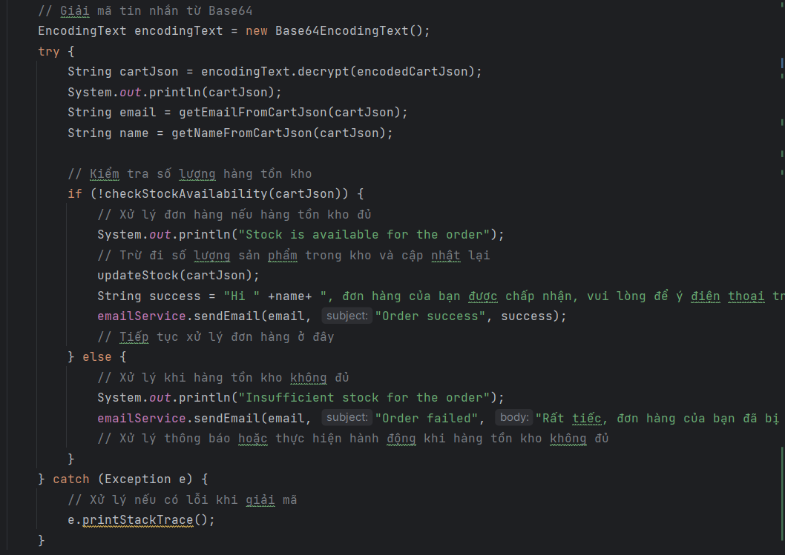

# KTPM_Tuan06
thực hành kiến trúc phần mềm tuần 6
## Danh sách các sản phẩm

## Giao điện giỏ hàng

## Dùng ActiveMQ

Client thông qua ứng dụng (desktop/web) gửi thông tin đặt hàng sau khi chọn lựa.  Thông tin này được chuyển về dạng json và được mã hóa dạng Base64

Khi Client click vào checkout.
Hệ thống sử dụng messaging service cho việc lắng nghe việc đặt hàng. 
Khi nhận được đơn hàng từ client, hệ thống sẽ giải mã về dạng json, sau đó kiểm tra số lượng trong kho có đủ không; sau đó quyết định đơn hàng có được xác nhận hay không.

* Nếu số lượng trong kho không đủ để thực hiện đơn hàng thì hệ thông sẽ gửi email thông báo:

* Nếu số lượng trong kho đủ để thực hiện đơn hàng thì hệ thống sẽ cập nhật lại số lượng trong kho và gửi email thông báo
  

  

